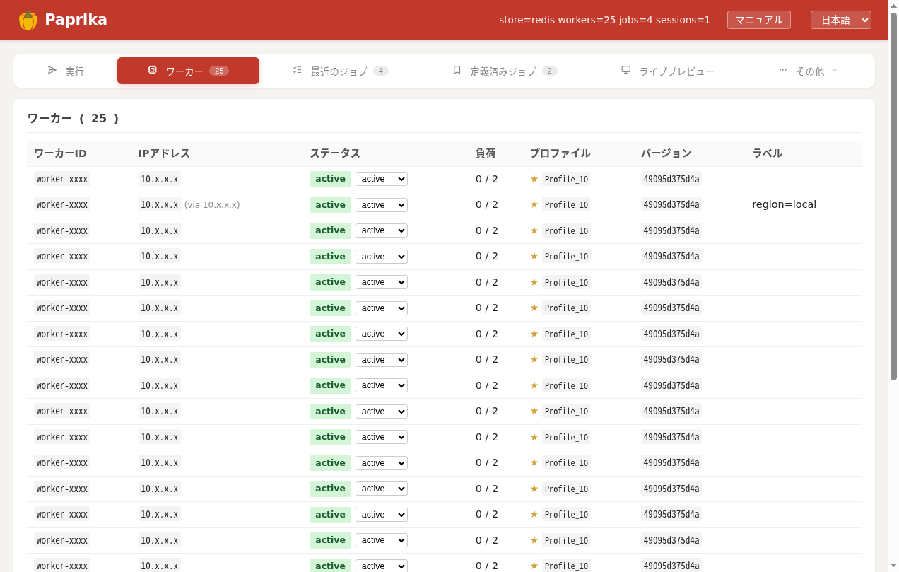

Worker は実際にブラウザを動かすホストです。自律的に動き、`--hub-url` を渡すだけで **自分を登録 → 心拍 → 割り当てジョブを実行 → 完了報告**まで行います。全体像は [アーキテクチャ概要](architecture.html)。


<p class="shot-cap">管理画面の <strong>ワーカー</strong> タブ。各ワーカーの Lane 数・状態・バージョン・所属 Hub が一目で分かります。</p>

## Lane プール

Worker は起動時に **N 本の「Lane」を先に立ち上げて常駐**させます（プール）。Lane は空のスロットではなく、**長命でステートを持つブラウザ**です。

```text
 Worker ホスト
 ├─ agent プロセス ──── WebSocket ───▶ Hub
 └─ Lane プール（起動時から常駐）
     ├─ Lane 0
     ├─ Lane 1
     └─ … （= 並列実行できるジョブ数）
```

- Lane の本数 = その Worker が**同時に処理できるジョブ数**（capacity）。
- ジョブが来ると Worker は **空き Lane を 1 本確保（acquire）** し、その Chrome で実行、終わったら**解放（release）**します。1 Lane = 同時に 1 ジョブ。
- Lane は使い回されるので、**クッキー / ログイン状態 / プロファイルがジョブをまたいで残ります**（`use_profile` を指定するとその Lane に操作者のプロファイルを差し込みます）。

## 1 本の Lane の中身

各 Lane は独立した X 画面と、それを覗くための VNC 一式を持ちます。

```text
 Lane i
  ├─ Xvfb              :100+i   仮想ディスプレイ（画面はあるが物理モニタは無い）
  ├─ fluxbox                    軽量ウィンドウマネージャ
  ├─ Chrome            :9223+i  remote-debugging(CDP) ポート ← ここを操作する
  ├─ x11vnc            :5901+i  Xvfb の画面を VNC で配信
  └─ noVNC(websockify) :6080+i  ブラウザから見られる形に橋渡し
```

つまり「**画面を持つ本物の Chrome**」を、モニタの無いサーバ上で動かしているだけです。だから JavaScript・動画再生・各種ダイアログなど、実ブラウザと同じ挙動になります。

## 「操作」と「閲覧」は別経路

Lane の Chrome に対して、**操作（自動化）** と **ライブ閲覧** は別の経路で行われます。

```text
 Hub / スクリプト ──── CDP ───────────────────────▶ Chrome を操作（クリック/取得/JS）
 操作者のブラウザ ─ noVNC(websockify) ─▶ x11vnc ─▶ Xvfb 画面 ⟵ Chrome が描画
```

- **操作** は CDP（Chrome DevTools Protocol、nodriver 経由）。ナビゲーション・クリック・スクロール・DOM 取得・通信トレースなど。
- **閲覧** は noVNC。管理画面の Live パネルや `#screens` で、いま Chrome に映っているものをそのまま見られます（[VNC 埋め込み](vnc-embed.html)）。Hub は worker の LAN IP を隠すため、noVNC をハブ経由のプロキシ URL に書き換えて配信します。

## アセットの取り方（passive network capture）

Paprika は HTML をパースして `` を読み、その URL に**再リクエスト**する方式ではありません。CDP の `Network.responseReceived` イベントを **passive にサブスクライブ**して、**ブラウザが実際にダウンロードしたレスポンス本体**をそのまま回収します。

```text
通常のスクレイパ:  ページ取得 → HTML パース →  から URL 取り出し → 改めてその URL に GET
Paprika:           ページ取得 → Chrome が画像をロード → CDP イベントで Paprika がレスポンスを横取り
```

この方式の利点:

- **帯域・サーバ負荷が半分** — 同じバイトを 2 回ダウンロードしない。
- **認証・Referer 必須の画像も取れる** — ブラウザがすでに正しい Cookie / Referer / セッションヘッダー付きで取得済みなので、別途リクエストして 403 / 401 になる事故が無い。
- **JS で動的に差し込まれた画像・lazy-load・CSS の `background-image`・`<iframe>`/ネスト iframe の内部通信**もすべて拾えます（HTML パースでは見つからない領域）。
- **動画ストリーム**（HLS の `.m3u8` セグメント、DASH の `.m4s`）も同じ仕組みで検出 → `yt-dlp` で連結（[動画の仕組み](video.html)）。

しきい値（`min_asset_size_bytes`）はこの passive リスナー段で適用されるので、アイコンやスペーサーの 100 byte 画像は最初から記録に上がりません（[JobOptions](job-options.html)）。

## ジョブとセッション

| | Lane の使い方 |
|---|---|
| **ジョブ（fetch）** | 1 本の Lane を確保 → 取得 → 解放。短時間で完結。 |
| **セッション** | Lane を**予約**し続け、Hub 経由の `/sessions/{sid}/*` で対話的・スクリプト的に操作。codegen-loop / SDK の `Page` / keep_session な fetch が使う。アイドル TTL・絶対 TTL で自動解放。 |

Hub から見たセッションの管理は [Hub の仕組み](architecture-hub.html)。

## 自己回復（self-healing）

Worker は「壊れたら自分で気づいて作り直す」設計です（詳細は [Worker 自己回復](worker-resilience.html)）。

- **Chrome の番犬** — Lane の Chrome が死んでも watchdog が**その Lane だけ**を再起動。Lane や他のプロセスは生きたまま。
- **接続断は再接続** — Hub との WebSocket が切れても、その場で**無期限に再接続**（自滅しない）。
- **定期リサイクル** — 一定ジョブ数ごとに drain → 終了 → docker が作り直し、状態をクリーンに保つ。

## 自己更新（self-update）{#self-update}

Hub はワーカー用のソースを配布し、**バージョンハッシュ**を WebSocket ハンドシェイクで突き合わせます。

```text
 接続 → Hub のバージョンと比較
   ├─ 一致   → そのまま稼働
   └─ 不一致 → Hub からソースを取得 → sys.exit(42) → スーパーバイザが再起動
```

`server/*.py` を直すだけで **手動 rsync 不要**でフリート全体が追従します（コード変更時の運用は [ワーカー自動デプロイ](worker-autodeploy.html)）。

---

戻る: [アーキテクチャ概要](architecture.html) / [Hub の仕組み](architecture-hub.html)
