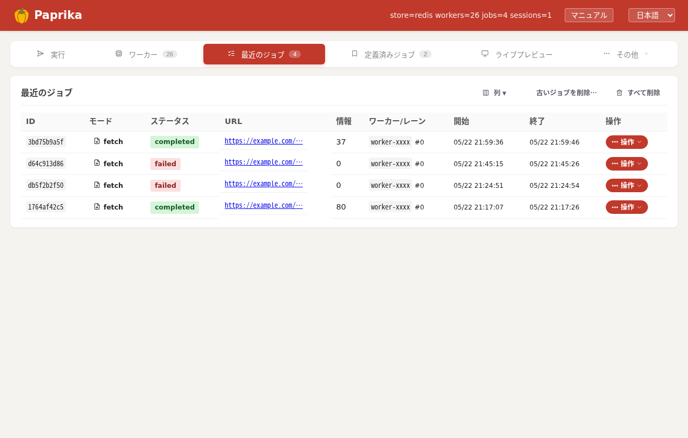

Paprika は「**分散したワーカー上の Chrome を、API / SDK / AI から動かしてページの画像・動画・リンクを集める**」プラットフォームです。このページで全体像 → Hub の中身 → Worker の中身 → ストア → スケール構成 までを通読できます。


<p class="shot-cap">クライアント面（管理画面の <strong>実行</strong> タブ）。ここから投入されたジョブが、下の図の Hub → Worker → Lane を経て返ってきます。</p>

<svg viewBox="0 0 920 440" role="img" aria-label="Paprika 全体構成図" style="display:block;max-width:100%;height:auto;margin:18px auto;font-family:ui-monospace,Consolas,monospace;">
  <defs>
    <marker id="ah" markerWidth="9" markerHeight="9" refX="7" refY="3" orient="auto"><path d="M0,0 L7,3 L0,6 Z" fill="#59636e"/></marker>
  </defs>
  <!-- Client -->
  <rect x="340" y="14" width="240" height="48" rx="9" fill="#fff" stroke="#d1d9e0"/>
  <text x="460" y="44" text-anchor="middle" font-size="17">Client / SDK / curl</text>
  <line x1="460" y1="62" x2="460" y2="100" stroke="#59636e" stroke-width="1.6" marker-end="url(#ah)"/>
  <text x="472" y="86" font-size="13" fill="#59636e">POST /jobs ・ GET /jobs/{id} ・ /sessions/*</text>
  <!-- Router -->
  <rect x="340" y="100" width="240" height="60" rx="9" fill="#fff" stroke="#d1d9e0"/>
  <text x="460" y="125" text-anchor="middle" font-size="17" font-weight="700">Router（nginx）</text>
  <text x="460" y="146" text-anchor="middle" font-size="13" fill="#59636e">複数 Hub のときだけ前段に立つ</text>
  <line x1="460" y1="160" x2="460" y2="198" stroke="#59636e" stroke-width="1.6" marker-end="url(#ah)"/>
  <!-- Hub -->
  <rect x="340" y="198" width="240" height="96" rx="10" fill="#fff" stroke="#c0392b" stroke-width="2"/>
  <text x="460" y="225" text-anchor="middle" font-size="20" font-weight="700" fill="#c0392b">Hub</text>
  <text x="460" y="251" text-anchor="middle" font-size="13" fill="#59636e">ジョブ受付・ディスパッチ</text>
  <text x="460" y="271" text-anchor="middle" font-size="13" fill="#59636e">セッション登録（Chrome は持たない）</text>
  <!-- Worker block -->
  <rect x="635" y="184" width="270" height="146" rx="10" fill="#fff" stroke="#d1d9e0"/>
  <text x="770" y="208" text-anchor="middle" font-size="15" font-weight="700">Worker（別ホスト × 多数）</text>
  <rect x="652" y="222" width="236" height="92" rx="8" fill="#f6f8fa" stroke="#d1d9e0"/>
  <text x="770" y="246" text-anchor="middle" font-size="14" font-weight="700">Lane（並列 N 本）</text>
  <text x="770" y="266" text-anchor="middle" font-size="13" fill="#59636e">Xvfb + Chrome (CDP)</text>
  <text x="770" y="286" text-anchor="middle" font-size="13" fill="#59636e">x11vnc + noVNC</text>
  <text x="770" y="305" text-anchor="middle" font-size="12" fill="#8a96a3">= 画面を持つ本物の Chrome</text>
  <line x1="580" y1="236" x2="633" y2="236" stroke="#59636e" stroke-width="1.5" marker-end="url(#ah)"/>
  <line x1="633" y1="254" x2="580" y2="254" stroke="#59636e" stroke-width="1.5" marker-end="url(#ah)"/>
  <text x="606" y="228" text-anchor="middle" font-size="12" fill="#59636e">WebSocket</text>
  <text x="606" y="270" text-anchor="middle" font-size="12" fill="#59636e">assign / 結果</text>
  <!-- Store -->
  <line x1="460" y1="294" x2="460" y2="346" stroke="#59636e" stroke-width="1.6" marker-end="url(#ah)"/>
  <text x="472" y="324" font-size="13" fill="#59636e">保存</text>
  <rect x="320" y="346" width="280" height="58" rx="9" fill="#f6f8fa" stroke="#d1d9e0"/>
  <text x="460" y="370" text-anchor="middle" font-size="15">ストア</text>
  <text x="460" y="392" text-anchor="middle" font-size="13" fill="#59636e">DB ・ オブジェクトストレージ ・ Redis</text>
</svg>

## 5 つの構成要素

| 要素 | 役割 |
|---|---|
| **Client / SDK** | あなたのコード。Python / PHP SDK、`curl`、または管理画面からジョブを投入します（[HTTP API](http-api.html)）。 |
| **Router（nginx）** | **複数 Hub 構成のときだけ**前段に立ち、リクエストを各 Hub に振り分けます。単一 Hub なら不要で、Client は Hub に直接話します。 |
| **Hub** | 司令塔。ジョブを受け付け、空いている Worker に割り当て（ディスパッチ）、セッションを登録し、結果をストアに保存します。Chrome は持ちません。 |
| **Worker** | 実際にブラウザを動かすホスト（多数）。起動時に **Lane** を N 本立ち上げ、Hub から WebSocket でジョブを受け取って実行します。 |
| **Lane（Chrome）** | 1 本 = 並列実行の 1 トラック。専用の Xvfb 画面 + Chrome + noVNC を持つ**長命のブラウザ**。クッキー/ログイン状態を保ったままジョブが通過します。 |

## リクエストの流れ（Fetch ジョブの例）

1. **投入** — Client が `POST /jobs`。(複数 Hub なら) Router がいずれかの Hub に振る。
2. **ディスパッチ** — Hub が空き Worker を選び、WebSocket で割り当てる（満杯なら `503`）。
3. **Lane 確保** — Worker が空き Lane を 1 本確保し、その Chrome でページを開く。
4. **取得** — スクロール・待機しながら画像/動画/リンクを収集（動画は通信トレース + yt-dlp）。
5. **保存** — 集めたアセットを Hub に **アップロード** → ストアへ保存。
6. **取得** — Client は `GET /jobs/{id}` で完了を待ち、`assets.json` から結果を取る。

AI モード（`codegen-loop`）では、Hub 自身が「LLM がスクリプトを生成 → サンドボックスで実行 → 失敗時に再生成」のループを回し、生成スクリプトが Hub の `/sessions/*` に接続して Worker の Lane を駆動します（[後述](#codegen-loop)）。

---

## Hub の仕組み {#hub}

Hub は司令塔です。**Chrome は持ちません** — クライアント API・Worker の WebSocket・管理画面を束ね、ジョブを Worker に割り当て、結果をストアに保存します。


<p class="shot-cap">Hub が受け付けたジョブは <strong>最近のジョブ</strong> タブで一覧できます。状態・ワーカー・所要時間・取得物数を一目で確認。</p>

### ジョブのディスパッチ

```text
 POST /jobs
   │  ① URL 検査・JobInfo を queued で保存
   ▼
 空き Worker を選ぶ (pick_worker)
   │  満杯なら数秒待つ → それでも無ければ 503
   ▼
 WebSocket で HubAssignJob を送信 ──▶ Worker が Lane を確保して実行
   │
   ▼  worker_id・noVNC URL を JobInfo に記録 → 返却
```

- Hub は **Chrome を持たない**ので、空き Worker が無ければ在庫待ちせず **`503`（fleet at capacity）** を返します。クライアントはバックオフ再試行を（[FAQ](faq.html)）。
- `pick_worker` は WebSocket 接続中で空き容量のある Worker を選びます。`docker compose restart hub` 直後など一瞬 Worker が居ない時間帯のために、数秒の **猶予ウィンドウ**を設けて待ってから 503 にします。

### 3 つのジョブモード

| モード | Hub が何をするか |
|---|---|
| **fetch** | その場で Worker にディスパッチ。Worker の取得エンジン（nodriver）がページを開いて画像/動画/リンクを収集。レシピがあれば適用。 |
| **codegen-loop**（AI） | **Hub 自身がループを回す** — LLM がスクリプトを生成 → サンドボックスで実行 → 失敗なら再生成。生成スクリプトは Hub の `/sessions/*` に接続して Worker の Lane を駆動。→ 下記 |
| **rerun**（Code） | 保存済み / インラインのスクリプトを LLM 抜きで実行（codegen-loop と同じ実行経路）。 |

fetch は同期的にディスパッチして即返し、codegen-loop / rerun は Hub 内の非同期タスクとして起動して即 `job_id` を返します（だから投入は速い）。

### codegen-loop（AI モード）{#codegen-loop}

```text
 goal（自然言語）
   │
   ▼
 ┌─ planner(LLM) → スクリプト生成
 │      ▼
 │  サンドボックスで実行 ──▶ /sessions/* ──▶ Worker の Lane(Chrome)
 │      ▼
 └─ 失敗なら judge(LLM) で原因分析 → 再生成（max_codegen_attempts まで）
```

Hub がブラウザを直接触るのではなく、**生成されたスクリプトが SDK と同じ経路（`/sessions/*`）で Worker の Lane を操作**します。これにより AI モードも手書きスクリプトも同じ実行基盤に乗ります。

### セッションレジストリ

「セッション」は **Lane の予約**です。`session_id → (worker, lane)` を Hub が管理し、`/sessions/{sid}/click` などの操作を**所有 Worker の Lane へ WebSocket で転送**します。

- セッションは、keep_session な fetch・codegen-loop・SDK の `Page` / `Session` などが開きます。
- **複数 Hub**ではセッションのライブ状態は所有 Hub にしか無いので、別 Hub に届いたリクエストは Redis の **セッションマップ（sid → 所有 Hub）** を引いて所有 Hub へ転送します。

### Worker の登録と心拍

Worker は Hub の `/workers/{id}/link` に WebSocket でつなぎ、**capabilities**（Lane 数・各 Lane の noVNC URL・バージョンハッシュなど）を送って登録します。以後 **約 15 秒ごとに心拍**を送り、`in_flight`（実行中ジョブ数）を更新します。

- バージョンハッシュが Hub の配布版と食い違うと、Worker は **ソースを取得して自己更新**します（[後述](#self-update)）。
- 心拍が途絶えた Worker は Hub が一覧から自動で掃除（reap）します。

---

## Worker・Lane・Chrome の仕組み {#worker}

Worker は実際にブラウザを動かすホストです。自律的に動き、`--hub-url` を渡すだけで **自分を登録 → 心拍 → 割り当てジョブを実行 → 完了報告**まで行います。


<p class="shot-cap">管理画面の <strong>ワーカー</strong> タブ。各ワーカーの Lane 数・状態・バージョン・所属 Hub が一目で分かります。</p>

### Lane プール

Worker は起動時に **N 本の「Lane」を先に立ち上げて常駐**させます（プール）。Lane は空のスロットではなく、**長命でステートを持つブラウザ**です。

```text
 Worker ホスト
 ├─ agent プロセス ──── WebSocket ───▶ Hub
 └─ Lane プール（起動時から常駐）
     ├─ Lane 0
     ├─ Lane 1
     └─ … （= 並列実行できるジョブ数）
```

- Lane の本数 = その Worker が**同時に処理できるジョブ数**（capacity）。
- ジョブが来ると Worker は **空き Lane を 1 本確保（acquire）** し、その Chrome で実行、終わったら**解放（release）**します。1 Lane = 同時に 1 ジョブ。
- Lane は使い回されるので、**クッキー / ログイン状態 / プロファイルがジョブをまたいで残ります**（`use_profile` を指定するとその Lane に操作者のプロファイルを差し込みます）。

### 1 本の Lane の中身

各 Lane は独立した X 画面と、それを覗くための VNC 一式を持ちます。

```text
 Lane i
  ├─ Xvfb              :100+i   仮想ディスプレイ（画面はあるが物理モニタは無い）
  ├─ fluxbox                    軽量ウィンドウマネージャ
  ├─ Chrome            :9223+i  remote-debugging(CDP) ポート ← ここを操作する
  ├─ x11vnc            :5901+i  Xvfb の画面を VNC で配信
  └─ noVNC(websockify) :6080+i  ブラウザから見られる形に橋渡し
```

つまり「**画面を持つ本物の Chrome**」を、モニタの無いサーバ上で動かしているだけです。だから JavaScript・動画再生・各種ダイアログなど、実ブラウザと同じ挙動になります。

### 「操作」と「閲覧」は別経路

Lane の Chrome に対して、**操作（自動化）** と **ライブ閲覧** は別の経路で行われます。

```text
 Hub / スクリプト ──── CDP ───────────────────────▶ Chrome を操作（クリック/取得/JS）
 操作者のブラウザ ─ noVNC(websockify) ─▶ x11vnc ─▶ Xvfb 画面 ⟵ Chrome が描画
```

- **操作** は CDP（Chrome DevTools Protocol、nodriver 経由）。ナビゲーション・クリック・スクロール・DOM 取得・通信トレースなど。
- **閲覧** は noVNC。管理画面の Live パネルや `#screens` で、いま Chrome に映っているものをそのまま見られます（[VNC 埋め込み](vnc-embed.html)）。Hub は worker の LAN IP を隠すため、noVNC をハブ経由のプロキシ URL に書き換えて配信します。

### アセットの取り方（passive network capture）

Paprika は HTML をパースして `` を読み、その URL に**再リクエスト**する方式ではありません。CDP の `Network.responseReceived` イベントを **passive にサブスクライブ**して、**ブラウザが実際にダウンロードしたレスポンス本体**をそのまま回収します。

```text
通常のスクレイパ:  ページ取得 → HTML パース →  から URL 取り出し → 改めてその URL に GET
Paprika:           ページ取得 → Chrome が画像をロード → CDP イベントで Paprika がレスポンスを横取り
```

この方式の利点:

- **帯域・サーバ負荷が半分** — 同じバイトを 2 回ダウンロードしない。
- **認証・Referer 必須の画像も取れる** — ブラウザがすでに正しい Cookie / Referer / セッションヘッダー付きで取得済みなので、別途リクエストして 403 / 401 になる事故が無い。
- **JS で動的に差し込まれた画像・lazy-load・CSS の `background-image`・`<iframe>`/ネスト iframe の内部通信**もすべて拾えます（HTML パースでは見つからない領域）。
- **動画ストリーム**（HLS の `.m3u8` セグメント、DASH の `.m4s`）も同じ仕組みで検出 → `yt-dlp` で連結。

しきい値（`min_asset_size_bytes`）はこの passive リスナー段で適用されるので、アイコンやスペーサーの 100 byte 画像は最初から記録に上がりません（[JobOptions](job-options.html)）。

### ジョブとセッション

| | Lane の使い方 |
|---|---|
| **ジョブ（fetch）** | 1 本の Lane を確保 → 取得 → 解放。短時間で完結。 |
| **セッション** | Lane を**予約**し続け、Hub 経由の `/sessions/{sid}/*` で対話的・スクリプト的に操作。codegen-loop / SDK の `Page` / keep_session な fetch が使う。アイドル TTL・絶対 TTL で自動解放。 |

### 自己回復（self-healing）

Worker は「壊れたら自分で気づいて作り直す」設計です（詳細は [Worker 自己回復](worker-resilience.html)）。

- **Chrome の番犬** — Lane の Chrome が死んでも watchdog が**その Lane だけ**を再起動。Lane や他のプロセスは生きたまま。
- **接続断は再接続** — Hub との WebSocket が切れても、その場で**無期限に再接続**（自滅しない）。
- **定期リサイクル** — 一定ジョブ数ごとに drain → 終了 → docker が作り直し、状態をクリーンに保つ。

### 自己更新（self-update）{#self-update}

Hub はワーカー用のソースを配布し、**バージョンハッシュ**を WebSocket ハンドシェイクで突き合わせます。

```text
 接続 → Hub のバージョンと比較
   ├─ 一致   → そのまま稼働
   └─ 不一致 → Hub からソースを取得 → sys.exit(42) → スーパーバイザが再起動
```

`server/*.py` を直すだけで **手動 rsync 不要**でフリート全体が追従します（コード変更時の運用は [ワーカー自動配信](worker-autodeploy.html)）。

---

## 3 つのストア

単一 Hub では Hub のローカルディスク + 任意の DB で完結します。**複数 Hub** では状態を共有するため 3 つに分かれます:

| ストア | 持つもの |
|---|---|
| **DB（MariaDB 等）** | ジョブ情報、各種レジストリ（ホスト設定・プリセット・スキル等） |
| **オブジェクトストレージ（MinIO / S3）** | 収集アセット（画像・動画・HTML）の本体 |
| **Redis** | 協調用の揮発状態 — ワーカー登録、セッションマップ（sid→所有 Hub）、リース、ライブプレビューのフレーム |

これにより **Hub は水平スケール可能（クローン安全）** で、どの Hub に当たっても同じジョブ・アセットが見えます。

- **JobInfo** は DB に保存（複数 Hub で共有）。`GET /jobs/{id}` はどの Hub からでも一貫して見えます。
- **アセット**は Worker から Hub にアップロードされ、オブジェクトストレージ（MinIO/S3）に保存。
- **Redis** はワーカー登録・セッションマップ・リース・ライブプレビューのフレームなどの揮発状態を共有。

## Router（nginx）と複数 Hub

Worker の制御 WebSocket（`/workers/{id}/link`）だけは **worker_id のハッシュで特定の Hub に固定**（sticky）。それ以外のリクエストは各 Hub に**ラウンドロビン**で分散します。

- ワーカー登録・ジョブ情報・アセットは共有ストアにあるので、どの Hub でも一貫して見えます。
- セッションのライブ状態（noVNC など）は所有 Hub にあるため、所有 Hub へ**転送**して整合させます。

> スケールの考え方は [Hub スケーリング](scaling.html)、サーバー構成は [サーバー構成](operations.html) も参照。

---

## 関連

| ページ | 内容 |
|---|---|
| [ジョブ分配と負荷分散](dispatch.html) | `pick_worker` のアルゴリズム、redrive ループ、stale reconciler、multi-hub での sticky 設計 |
| [Vision AI とマウス](vision-mouse.html) | 視覚エージェント（CogAgent / Qwen-VL）がスクリーンショットを見てピクセル座標でクリック・操作するしくみ |
| [VNC 埋め込み](vnc-embed.html) | hub-proxy の noVNC ライブ画面を、自前の Web ページに `iframe` で埋め込む実装 |
| [Hub スケーリング](scaling.html) | 複数 Hub に水平スケールするときの考え方とルーティング |
| [Worker 自己回復](worker-resilience.html) | Worker が壊れたら自分で気づいて作り直す自己回復ループ |
| [Worker 自動配信](worker-autodeploy.html) | server コードを変えただけでフリート全体が追従する仕組み |
| [サーバー構成](operations.html) | A. 1 台で全部 / B. ハブ + リモート Worker / C. Hub のみ |
