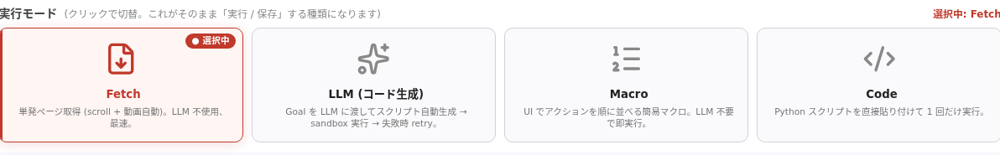

主な変更だけ抜粋して時期別にまとめます。すべての変更は [GitHub のコミット履歴](https://github.com/paps-jp/paprika/commits/main) を参照してください。

実行モードの UI（<strong>Fetch / AI / Script / Macro</strong>）— Paprika のジョブモデルそのものを反映した管理画面の入口。

---

## 2026-06

### マルチハブ運用が標準化

- **クロスハブ転送**: セッション・noVNC・ジョブ取得・スクリーンショットなどを所有 Hub へ自動転送。どの Hub に当たっても同じ挙動になり、管理画面の点滅も解消。
- **クローン安全な Hub ID**: ホスト IP から自動導出（`hub-35` 等）。VM クローンしてもオーファン誤判定しない。
- **nginx 自動再構成**: 新しい Hub が起動すると LB に自動登録（reconciler、`docker-compose.reconciler.yml`）。
- **共有レジストリ**: 設定・ホスト情報・スキル/会話規約/プリセット・拡張機能・Chrome プロファイルを MariaDB + MinIO で共有。どの Hub からも同じものが見える。
- **クロスハブ・ディスパッチ**: 自 Hub が満杯でも、空き容量のあるピア Hub に**ジョブを転送**して 503 を減らす。
- 詳細は [Hub の仕組み](architecture-hub.html) / [Hub スケーリング](scaling.html)。

### セッションが Hub 再起動を生き残るように（P1/P2）

- **完全な SessionInfo を Redis に永続化** → 再起動した Hub やピア Hub が同じセッションを再構成可能。
- **`/sessions/*` のクロスハブ集約**で、ライブプレビューのフラップ（RUNNING ↔ keepalive の点滅）が解消。
- **ワーカー WS 切断時もセッション維持**: 一時的な切断で Worker 側がセッションを強制終了しないように修正。

### ゼロダウンタイム更新

- **`worker+hub: zero-downtime rolling update`** — Hub 側が「期待バージョン」を心拍で広告し、Worker が新バージョンへ段階的に切り替え。再起動中もジョブが落ちない。
- 既存の **自己更新（exit 42）** と組み合わせ、`hub` の再起動だけでフリート全体が静かに新版へ移行。
- 詳細は [Worker の仕組み](architecture-worker.html#self-update) / [Worker 自己回復](worker-resilience.html) / [ワーカー自動デプロイ](worker-autodeploy.html)。

### Worker 信頼性

- **ハング検知 watchdog v2** — 詰まったハブリンクを別ループから監視し、確実に救済。
- **Chrome の UA を `get_version` タプルから読む** — 一部サイトでのフラグメント 403 を修正。

### 管理画面

- **Workers タブをサブタブ化**（一覧 / ハブ / 機能）。ハブ ID / バージョンを色分けし、更新中も badge が安定。
- **`#screens` ライブプレビュー** — プッシュ型フレームに変更（取得レートとポーリングレートを分離）、20 タイル/ページのページネーション、`#screens` から `#live` への深リンク。
- **取得方法ラジオ**の change 配線を遅延参照に修正（`syncFetchSubMode` の ReferenceError が他機能を巻き込んで停止していた）。
- **ヘッダのバナー数値**を「共有 `/workers` 件数」に変更（自ハブのローカル件数で点滅していた）。
- **`admin.js` を 10 ファイルに分割**（13k 行 → 機能別）。

### ドキュメント

- **Jekyll 化** — `_includes/header.html` でナビを共有、新ドキュメントは Markdown で書ける。
- 新ページ: **HTTP API**（任意の言語から）、**FAQ**、**動画の取得と配信のしくみ**、**アーキテクチャ概要 / Hub の仕組み / Worker の仕組み**、**クイックスタート**、**CHANGELOG**（本ページ）。
- ナビ整理（Home → ロゴ、運用 / 設計 を直リンク化、学ぶ ▾ に統合）。

---

## 既知の挙動

- **`503 fleet at capacity`** はワーカー満杯時の正常な背圧です。指数バックオフ再試行を（[FAQ](faq.html#retry-503)）。SDK は自動でリトライします。
- **DRM 動画**（Widevine / FairPlay / PlayReady）は取得できません（仕様、[動画の仕組み](video.html)）。
- **Windows ワーカー**（portable build）は Linux フリートと別経路で動作（noVNC ではなく CDP screencast）。

---

## バージョニング方針

Paprika はまだ **`dev`** タグで運用しており、SemVer タグは未付与です。事実上のリリース単位は「**Hub をローリング再起動した時点**」で、Worker は自己更新で追従します。

正式な SemVer 採用と GitHub Release の発行は今後の予定です。それまでは本ページとコミット履歴を参照してください。
