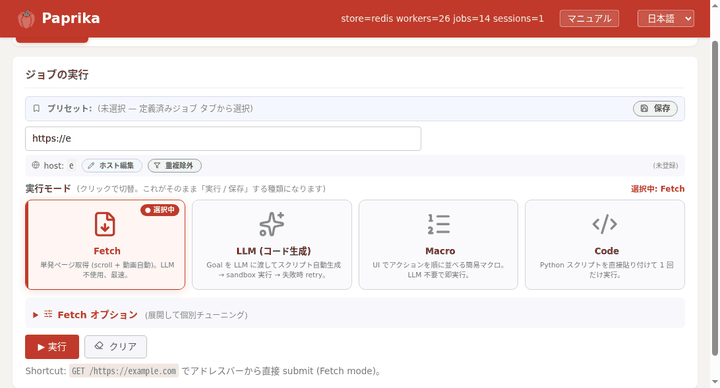

使う側でよく出る質問とハマりどころをまとめました。基本の使い方は [Client インストール](intro.html) / [ガイド](guides.html)、API は [HTTP API](http-api.html) / [API リファレンス](api.html) を参照してください。

<video class="shot" width="1096" height="664" autoplay loop muted playsinline preload="metadata" aria-label="管理画面の Live パネル — ジョブの実行ログとブラウザ画面がリアルタイムに表示される">
  <source src="img/admin-live.webm" type="video/webm">
  <source src="img/admin-live.mp4" type="video/mp4">
  
</video>

うまく動かないときの一次情報は管理画面の <strong>Live パネル</strong>（実行ログ＋ noVNC ライブ画面）です。

## `503 fleet at capacity` が返る

フリート（ワーカー）が全レーン埋まっているときの **正常な背圧** です。Hub は満杯時に在庫待ちせず即 `503` を返すので、**クライアント側で指数バックオフ再試行**してください（1, 2, 4, 8 秒…）。SDK は自動でリトライします。素の HTTP で叩く場合の実装例は [HTTP API の 503 リトライ](http-api.html#retry-503) を参照。

## ジョブが終わらない / タイムアウトする

- `options.attempt_timeout_s` で 1 試行の上限を調整。
- `options.wait_seconds` / `idle_seconds` でページ読み込み・ネットワーク無通信の判定を調整。
- まず**ログを見る**のが近道: `GET /jobs/{id}/log.txt`、またはライブで `WS /jobs/{id}/events`、管理画面の **Live パネル**。

## 画像が 0 件 / 少ない

- `options.min_asset_size_bytes` のしきい値で小さい画像が除外されています → **`0`** にすると全部拾います。
- 遅延ロード（lazy）の画像は `options.scroll: true` で最後までスクロールすると拾えます。
- `options.capture_assets`（既定 `true`）が `false` になっていないか確認。

## ログインが必要なサイト

3 通りあります:

1. **Paprika Bridge 拡張**（推奨）— ブラウザの `chrome.cookies` を Hub に push します。最新 Chrome の App-Bound 暗号化 Cookie も扱えます。
2. **`use_profile`** — ログイン済みの Chrome プロファイルをアップロードして指定。
3. **AI モード**（`mode: codegen-loop`）— `goal` に「ログインして〜」と書けば LLM がフォーム入力します。

詳しくは [ガイド: ログイン必須サイト](guides.html) を参照。

## 認証画面・確認ダイアログが抜けない

- `fetch` モードは、そのサイト用のレシピがあれば自動で処理します。
- 無い場合は **AI モード**（`codegen-loop`）が `page.agent()` で画面を見て突破します。`goal` に「確認画面が出たら進めて」のように明示すると確実です。

## 動画が取れない

- `options.download_video: true` を指定してください（既定 `false`。指定すると通信トレース + yt-dlp が有効になります）。
- HLS / DASH（`.m3u8` / `.mpd`）は **再生を発火しないと URL が出ない**ことがあります → AI モードで「動画を再生してからダウンロード」と指示するのが確実です。

## Cookie がすぐ切れる

セッション Cookie の期限切れです。Bridge 拡張で再 push するか、そのホストに**ログインレシピ**を設定しておくと、期限切れ時に自動再ログインされます。

## どのモードを使えばいい?

| モード | 向いている場面 | 速度 / コスト |
|---|---|---|
| `fetch` | 既知サイト / 画像をざっと収集 | **速い**・LLM 不使用 |
| `codegen-loop`（AI） | 未知サイト / 複雑な操作 / 動画 | LLM が走る（**課金**）・賢い |
| `rerun`（Code） | 自分で書いたスクリプトを実行 | 確定的・LLM 不使用 |

迷ったら `fetch` で試し、うまく拾えなければ AI モードに上げる、が定石です。

## 同期 / 非同期はどっち?

`async` が基本です。スクリプトを手早く書きたいときは同期版（`sync_paprika`）も使えます。詳細は [API リファレンス](api.html)。

## 自分の環境で動かしたい（セルフホスト）

`docker compose up` で Hub + worker + redis 一式が立ち上がります。構成と運用は [サーバー構成](operations.html) を参照してください。

## まだ解決しない

実行ログ（`GET /jobs/{id}/log.txt`）と管理画面の **Live パネル**が一次情報です。再現するバグは [GitHub Issues](https://github.com/paps-jp/paprika/issues) へどうぞ。
