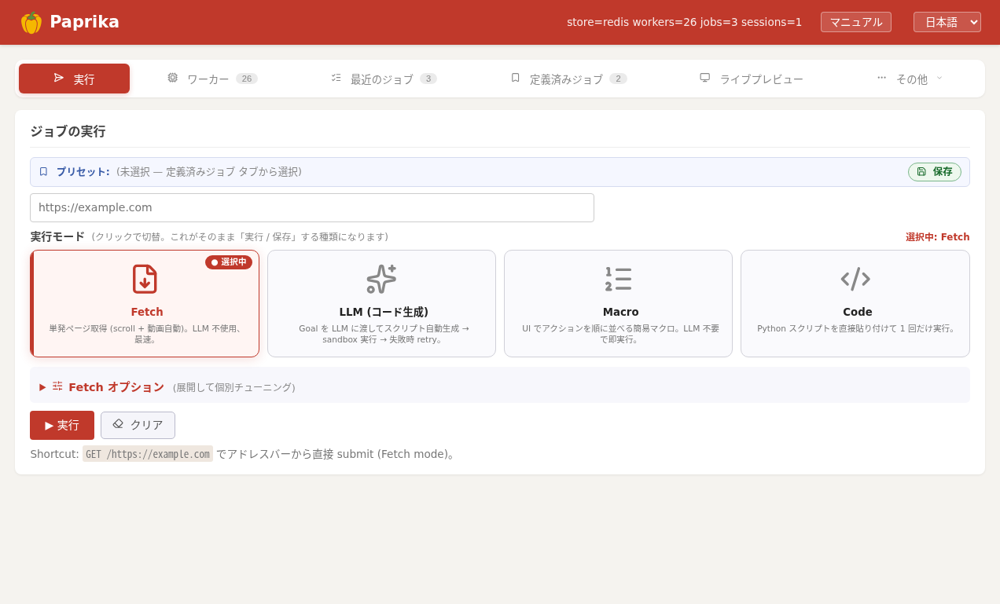

Paprika の **サーバー側**（Hub + Worker + Redis 一式）を自分の環境に立ち上げる手順です。`docker compose up` で一式を起動し、最初のジョブを投げて結果を取るまで **5 分**で動作確認できます。

> クライアント側（SDK）から接続するだけなら [Client インストール](intro.html) へ。概念は [アーキテクチャ概要](architecture.html)、API は [HTTP API](http-api.html) を参照。

## 必要なもの

- **Docker** + **Docker Compose**（v2 系。`docker compose` コマンドで動くもの）
- **Git**
- **メモリ目安**: ワーカー 1 Lane あたり 約 500 MB〜1 GB（既定 2 Lane = 1〜2 GB を確保）

> 対応 OS: **Linux** / **macOS**。GitHub Pages 配信のこのドキュメントでは Windows 手順は扱いません。

## 1. リポジトリを取得

```bash
git clone https://github.com/paps-jp/paprika.git
cd paprika
```

## 2. 設定ファイルを作る

```bash
cp .env.example .env
```

最初は **そのまま**で動きます（同一ホストで Hub と Worker を立てる構成のため）。別ホストにワーカーを足すときだけ、後で `.env` を編集します（[ワーカーを別ホストに追加](#add-worker)）。

## 3. 起動

```bash
docker compose up -d --build
```

立ち上がるサービス:

| サービス | 役割 | ポート |
|---|---|---|
| **redis** | 揮発状態の共有（複数 Hub 構成の基盤） | 6379 |
| **hub** | API ・ 管理画面 ・ Worker 制御 | **8000** |
| **worker** | ブラウザ Lane × N（既定 2） | （内部） |
| **agent** | ジョブログ等のサイドカー | （内部） |

> 既定で **Lane = 2**（= 同時実行 2 ジョブ）。後で `.env` の `LANE_POOL` / `MAX_CONCURRENT` を増やせます。

## 4. 動いているか確認

```bash
curl http://localhost:8000/health
```

`status: ok` と接続中のワーカー数が返れば成功です。**管理画面**は次の URL でも開けます。

```text
http://localhost:8000/
```


<p class="shot-cap">起動直後の管理画面（実行タブ）。URL を入れて押すだけでジョブを投入できます。</p>

## 5. 最初のジョブを投げる

```bash
curl -X POST http://localhost:8000/jobs \
  -H 'Content-Type: application/json' \
  -d '{"url":"https://example.com","options":{"mode":"fetch","capture_assets":true}}'
```

返ってきた `job_id` を控えます。

完了を待ちます:

```bash
JID=<job_id>
while :; do
  s=$(curl -s "http://localhost:8000/jobs/$JID" | python -c 'import sys,json;print(json.load(sys.stdin)["status"])')
  echo "$s"; case "$s" in completed|failed|cancelled) break;; esac; sleep 2
done
```

取れたものを見ます:

```bash
curl -s "http://localhost:8000/jobs/$JID/assets.json"
```

API の詳しい使い方は [HTTP API](http-api.html) を、SDK は [はじめに](intro.html) を参照。

## 6. SDK から叩く（任意）

```bash
pip install paprika-client
export PAPRIKA_HUB=http://localhost:8000
```

```python
import asyncio
from paprika_client import paprika

async def main():
    async with paprika() as cli:
        result = await cli.fetch("https://example.com")
        print(result.assets)

asyncio.run(main())
```

## ワーカーを別ホストに追加 {#add-worker}

同じ Hub に **別マシンのワーカー** をぶら下げてスケールできます。ワーカー側ホストで:

```bash
git clone https://github.com/paps-jp/paprika.git
cd paprika
cp .env.example .env
```

`.env` を編集:

```ini
# Hub の場所
HUB_URL=ws://<hub-host>:8000

# このワーカーの LAN IP / DNS。noVNC ライブ画面のリンク生成に使う
NOVNC_PUBLIC_HOST=<this-host-lan-ip>
```

起動:

```bash
docker compose -f docker-compose-worker.yml up -d --build
```

Hub の管理画面で **ワーカー一覧**に出てくれば成功です。

## よく使う操作

```bash
# ログを見る
docker compose logs hub --tail 50
docker compose logs worker --tail 50

# 設定変更を反映
docker compose restart hub

# 一旦止める / 再開
docker compose down
docker compose up -d
```

ワーカー側コードを変えたとき: 普段は **ハブを再起動するだけで OK**。ワーカーは次のハンドシェイクで自動更新します（[ワーカー自動デプロイ](worker-autodeploy.html)）。

## うまく動かないとき

- **`/health` が応答しない** — `docker compose logs hub` を確認。8000 番が他で使われていないか。
- **ジョブが `queued` のまま** — ワーカーが繋がっていません。`docker compose logs worker` を確認。
- **`503 fleet at capacity`** — ワーカーが満杯です。`LANE_POOL` を増やすか、別ホストにワーカーを足す。クライアントは指数バックオフ再試行を（[FAQ: 503](faq.html#retry-503)）。
- **ライブ画面（noVNC）が映らない** — `NOVNC_PUBLIC_HOST` がそのワーカーの **LAN IP / DNS** になっているか確認。

## 次のステップ

- [はじめに](intro.html) — 概念と基本操作
- [ガイド](guides.html) — 画像/動画取得、ログイン、`walk` など実用パターン
- [HTTP API](http-api.html) — 任意の言語から叩く
- [サーバー構成](operations.html) — 本格運用への 3 つのパターン
- [Hub スケーリング](scaling.html) — 複数 Hub に水平スケール
