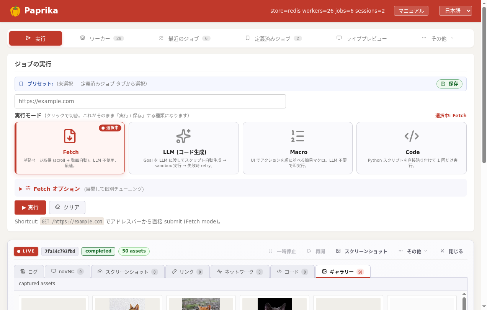

「**目的**」から逆引きで使い方を見せます。**完成スクリプト**と**得られる結果**のセットで載せました。準備は [クイックスタート](quickstart.html) と [HTTP API](http-api.html) を、API の細目は [リファレンス](api.html) を参照してください。


<p class="shot-cap">取得が終わると、画像・動画は管理画面の <strong>ギャラリー</strong>と <code>/jobs/{id}/assets.json</code> から取り出せます。</p>

## ① 1 ページの画像を一括で集める

ECサイトの商品ページや記事ページから、表示されている画像（lazy-load も含む）をまとめて回収します。

```python
import asyncio
from paprika_client import paprika

async def main():
    async with paprika() as cli:
        job = await cli.fetch(
            "https://example.com/items/12345",
            scroll=True,                    # 最後までスクロール → lazy-load も拾う
            capture_assets=True,
            min_asset_size_bytes=2048,      # ノイズ（小さいアイコン類）を除外
        )
        for a in job.assets:
            print(a.kind, a.size, a.href)   # /jobs/{id}/assets/<name>

asyncio.run(main())
```

得られるもの: `job.assets`（`image` / `video` / `other`、`href` は Hub からのダウンロード URL）+ `page.html`（取得時の HTML）。

> 詳細は [ガイド: 画像を一括で取得](guides.html) / [HTTP API: ダウンロード](http-api.html)。

## ② 動画ページから動画をダウンロード

動画配信は HLS/DASH の場合があり、**再生を発火**しないと URL が出ません。`page.agent()` で再生 → `page.download_video()` で取得します。

```python
import asyncio
from paprika_client import paprika

async def main():
    async with paprika() as cli:
        async with cli.session("https://video.example/watch/abc") as page:
            # 再生ボタンを LLM に任せて押す（CSS が効かない画面でも OK）
            await page.agent("メイン動画を再生して", max_steps=3)
            # 通信トレース上の m3u8 / mp4 を yt-dlp で取得・連結
            video = await page.download_video()
            print(video.href)

asyncio.run(main())
```

得られるもの: 1 本の動画ファイル（コンテナへ連結済み）。動画は **画像と同じアセット扱い**で `assets.json` の `kind: "video"` に並びます（[動画の仕組み](video.html)）。

> DRM 配信は取得不可です。

## ③ サイト全体をアーカイブ（walk で BFS クロール）

トップから辿れるページを順に巡回して、各ページの HTML と画像を保存します。`walk()` が dedup・depth 制御・dead-end フィルタを内部で処理します。

```python
import asyncio
from paprika_client import paprika, walk

async def main():
    async with paprika() as cli:
        async with cli.session("https://example.com") as page:
            async for visit in walk(
                page,
                target_pages=200,          # 上限
                same_domain=True,          # 同一ドメインのみ
                max_depth=3,
            ):
                await visit.capture()       # ページごとに HTML + 画像を保存
                print(f"[{visit.index}/{visit.target}] {visit.url}")

asyncio.run(main())
```

得られるもの: 各ページの HTML と画像が、その時のセッションのアセットとして蓄積。途中経過は管理画面の **Live パネル**でリアルタイム確認できます。

> 主オプション: `target_pages` / `same_domain` / `allowed_domains` / `max_depth` / `host_dedup`。[API: walk](api.html#walk) も参照。

## ④ ニュースサイトの新着リンクだけ拾う

トップページからリンクを列挙して、巡回せず**一覧だけ**取り出します。

```python
import asyncio
from paprika_client import paprika

async def main():
    async with paprika() as cli:
        async with cli.session("https://news.example.com") as page:
            links = await page.links(same_domain=True)
            for l in links[:20]:
                print(l.text or "", "→", l.href)

asyncio.run(main())
```

得られるもの: そのページから抽出した遷移可能リンク一覧。**何件あるかだけ知りたい**用途や、**外部のクローラに渡す前段**として軽量に使えます。

## ⑤ ログインが必要なサイトから取得

ログインしてから商品ページを fetch します。ログイン手順は **AI** に任せます。

```python
import asyncio
from paprika_client import paprika

async def main():
    async with paprika() as cli:
        # 1) AI で 1 回ログイン → Cookie をホストへ保存
        async with cli.session("https://market.example/login") as page:
            await page.agent(
                "ID=alice / PW=secret でログインして",
                max_steps=5,
            )
            await page.save_cookies()   # /hosts/{host} に保存（次回以降は自動注入）

        # 2) その Cookie で商品ページを fetch
        job = await cli.fetch(
            "https://market.example/item/xxx",
            capture_assets=True,
        )
        print(len(job.assets), "assets")

asyncio.run(main())
```

ポイント:

- 一度 **`save_cookies()`** すれば、以後 **`cli.fetch(...)` でも自動で Cookie が注入**されます。
- セッション Cookie の期限切れも、**ホストにログインレシピを登録**しておけば自動再ログインで救えます（[FAQ: Cookie がすぐ切れる](faq.html)）。
- Chrome 上のログインを丸ごと持ち込みたい場合は **Paprika Bridge 拡張**または **`use_profile`**（[FAQ: ログイン必須サイト](faq.html)）。

## ⑥ AI に丸投げ（codegen-loop）

未知のサイトで何が必要か分からないとき、URL と **目的（自然言語）** だけ投げると、LLM がスクリプトを生成・実行・失敗時に再生成します。

```bash
curl -X POST http://localhost:8000/jobs \
  -H 'Content-Type: application/json' \
  -d '{
    "url":"https://example.com",
    "options":{
      "mode":"codegen-loop",
      "goal":"このページの本文 HTML と、本文中に出てくる画像を集める",
      "max_codegen_attempts": 3
    }
  }'
```

完成したスクリプトは **次回からそのまま `mode: rerun`** で実行できます（LLM 費用なし、決定的に動作）。

> 仕組みは [Hub の仕組み: codegen-loop](architecture-hub.html#codegen-loop) を参照。

## ⑦ 任意の言語から HTTP で叩く

Python / PHP の SDK を使わなくても、**`curl` / JS / Go** で同じことができます。

```javascript
async function fetchOne(url) {
  const hub = process.env.PAPRIKA_HUB;       // e.g. http://localhost:8000
  const r = await fetch(`${hub}/jobs`, {
    method: 'POST',
    headers: { 'Content-Type': 'application/json' },
    body: JSON.stringify({ url, options: { mode: 'fetch', capture_assets: true } }),
  });
  if (r.status === 503) throw new Error('fleet busy — retry with backoff');
  const { job_id } = await r.json();
  // ポーリングして完了を待つ → /jobs/{id}/assets.json
  // ...
}
```

詳細は [HTTP API](http-api.html) を参照。`503` の指数バックオフ再試行を忘れずに（[FAQ](faq.html#retry-503)）。

---

## どれを使うかの早見表

| やりたいこと | 推奨 |
|---|---|
| 既知の 1 URL の画像を取る | **`cli.fetch(url, scroll=True)`** |
| 動画ページから動画 | **`session` + `page.agent("再生して")` + `page.download_video()`** |
| サイト全体を保存 | **`session` + `walk()`** |
| リンク一覧だけ | **`session` + `page.links()`** |
| ログイン後の取得 | **`session` で `agent` ログイン → `save_cookies()` → `cli.fetch`** |
| 未知サイトに丸投げ | **`mode: codegen-loop`** |
| 任意の言語から | **HTTP（`POST /jobs`）** |

## 次のステップ

- [ガイド](guides.html) — 各手順の細目
- [サンプル](examples.html) — API スニペット集
- [API リファレンス](api.html) — Python / PHP SDK の全引数
- [HTTP API](http-api.html) — SDK 不要で叩く
